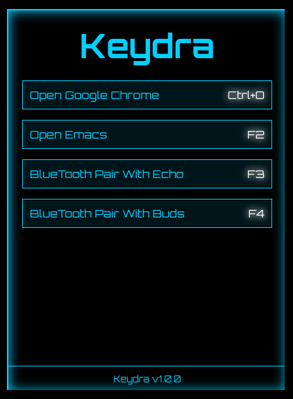

# Keydra

<table>
  <tr>
    <td>
      <p>
      Inspired by emacs-hydra, Keydra addresses the challenge of remembering numerous linux shell functions by allowing users to create menus of keybinds, referred to as "keydras." This approach makes it possible to manage more commands than traditional keybind systems would feasibly allow.
      </p>
      
- **Infinite Keybindings**: Organize and trigger an unlimited number of commands via custom keybindings.
- **Descriptive Command Names and Help Text**: Enhance command recall with helpful descriptions right in the interface.
- **Keybinds are set through human-readable text files**: Easily configure keybinds and command menus using simple text files.
- **Dynamic Window Attributes**: Customize the window title and colors dynamically via the command line for each session.
    </td>
    <td>
      
    </td>
  </tr>
</table>

## How to run

Run 

``` bash
electron -c Keydra.ini -t Keydra --he 550 --wi 400
```

to get the example image above.

## Customizing the Keydra attributes

You can change the title, colors and shell interpreter.

## Using with the i3 window manager

If you are using the i3 window manager, in the i3 config please add the lines

``` text
for_window [class="keydra"] floating enable
```

to make sure the window floats.

